# Week 1 {#week1}


```{r, echo=FALSE}
library(knitr)
library(kableExtra)
```

<h2>Topics: Getting started; Introduction to R/RStudio/RMarkdown; file systems</h2>

## Getting started on Terminal Server 4
First, make sure you have the Husky OnNet VPN application running and have connected to the UW network. You should see the f5 icon in your task area:

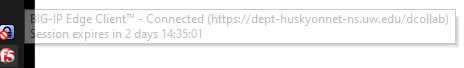

Connect to TS4: `csde-ts4.csde.washington.edu`

If you are using the Windows Remote Desktop Protocol (RDP) connection, your connection parameters should look like this:


If you are using mRemoteNG, the connection parameters will match this:


Once you are connected you should see a number of icons on the desktop and application shortcuts in the Start area.

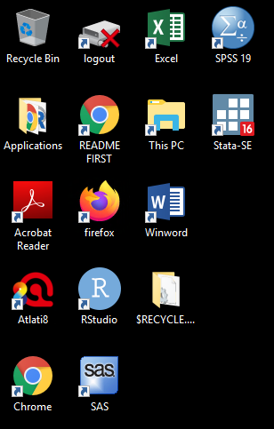

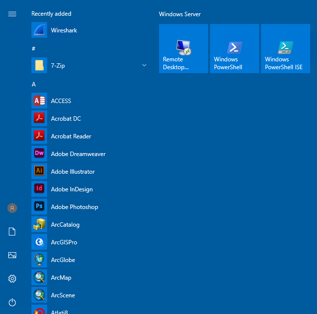

Open a Windows Explorer (if you are running RDP in full screen mode you should be able to use the key combination Win-E).

Before doing anything, let's change some of the annoying default settings of the Windows Explorer. Tap `File > Options`. In the `View` tab, make sure that `Always show menus` is checked and `Hide extensions for known file types` is unchecked. The latter setting is very important because we want to see the complete file name for all files at all times.

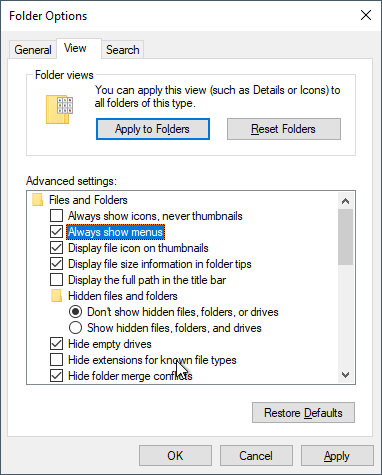

Click `Apply to Folders` so that these settings become default. Click `Yes` to the next dialog.

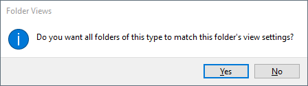

Now let's make a folder for the files in this course.

Navigate to This PC:

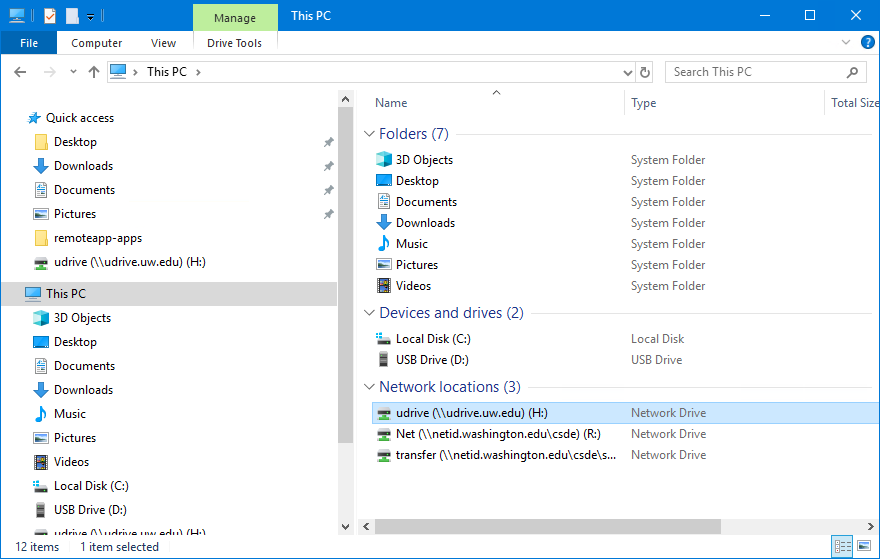

You should see the `H:` drive. This is is the mapped drive that links to your [U Drive](https://itconnect.uw.edu/wares/online-storage/u-drive-central-file-storage-for-users/), and is the place where all of the data for this course is to be stored. __Do not store any data on the `C:` drive!__ The `C:` drive can be wiped without any prior notification.

__Be very careful with your files on the U Drive!__ If you delete files, there is no "undo" functionality. When you are deleting files, you will get a warning that you should take seriously:

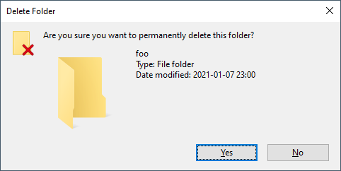

Navigate into `H:` and create a new folder named `csde502_winter_2021`. Note the use of lowercase letters and underscores rather than spaces. This will be discussed in the section on file systems later in this lesson.

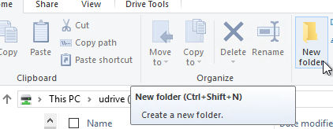

## Introduction to R Markdown in RStudio
### Create a project
Now we will use RStudio to create the first R Markdown source file and render it to HTML.

Start RStudio by either dbl-clicking the desktop shortcut or navigating to the alphabetical R section of the Start menu:

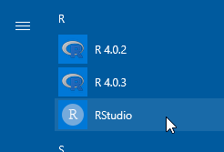

Create a new project (`File > New Project...`).

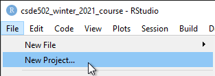

Since we just created the directory to house the project, select `Existing Directory`.

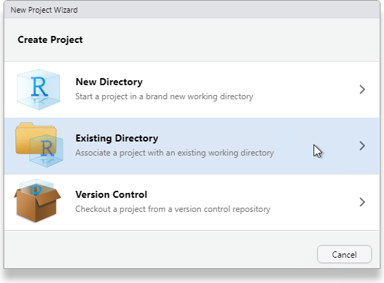

Navigate to that directory and select `Open`.

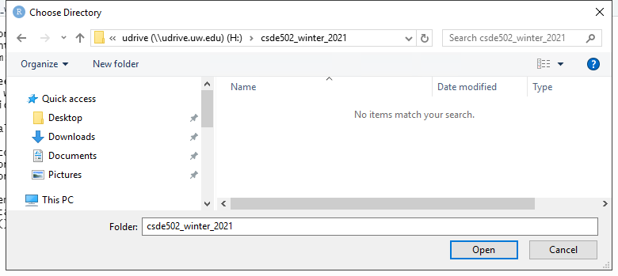

Click `Create Project`.

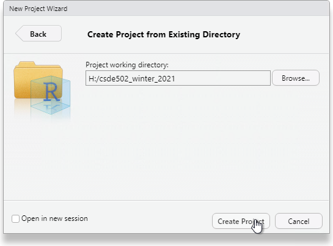

You will now have a blank project with only the project file.

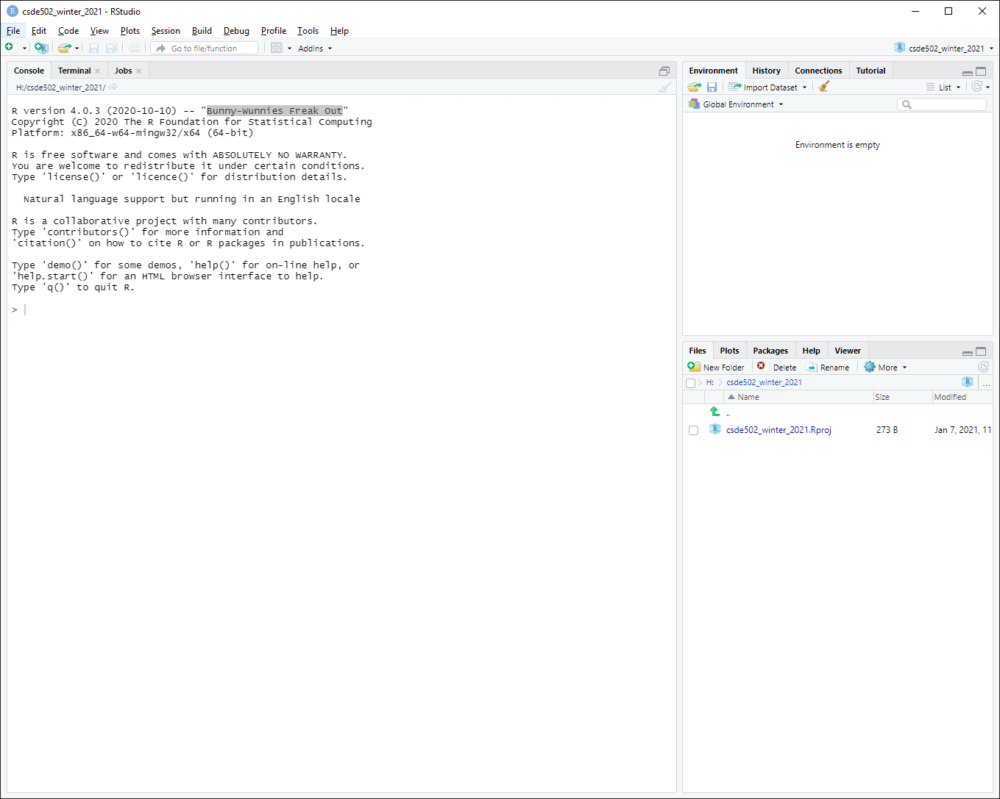

### Create an R Markdown file from built-in RStudio functionality
Let's make an R Markdown file (`File > New File > R Markdown...`).

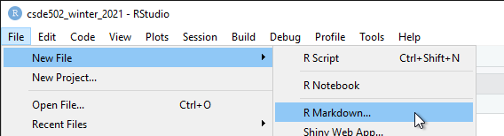

Do not change any of the metadata ... this is just for a quick example.

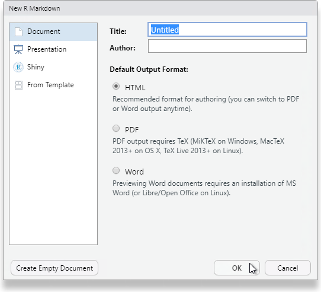

Click `OK` and then name the file `week_01.Rmd`.

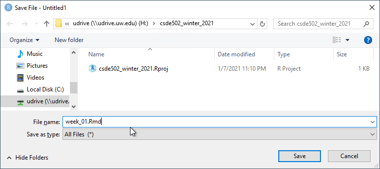

#### Render the Rmd file as HTML

At the console prompt, enter `rmarkdown::render("W` and tap the `TAB` key. This should bring up a list of files that have the character "w" in the file name. Click `week_01.Rmd`.

The syntax here means "run the `render()` function from the `rmarkdown` package on the file `week_01.Rmd`"

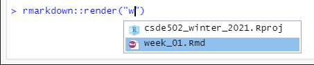

After a few moments, the process should complete with a message that the output has been created.

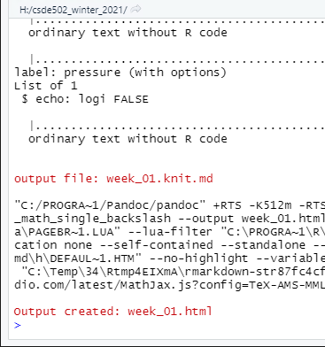

You should see `week_01.html` in the list of files. Click it and select `View in Web Browser`.

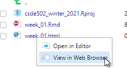

You will now see the bare-bones HTML file.

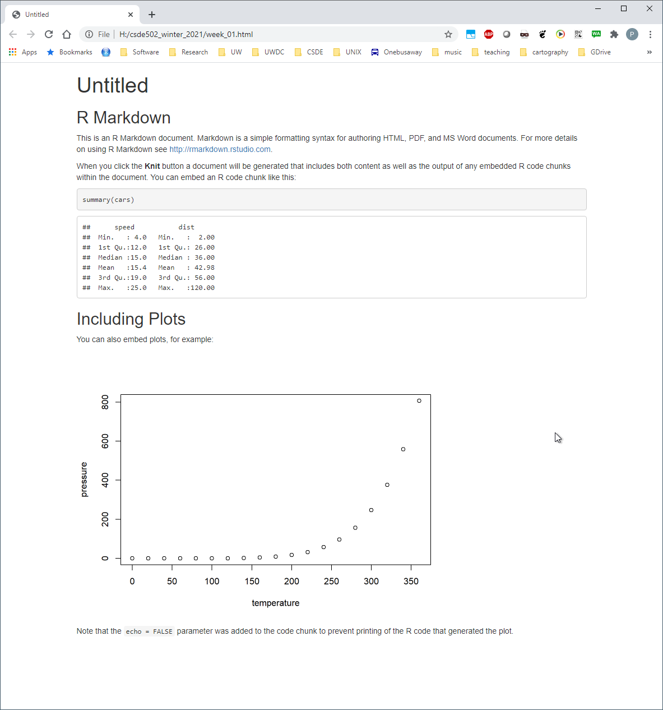

Compare the output of this file with the source code in `week_01.Rmd`. Note there are section headers that begin with hash marks, and R code is indicated with the starting characters 

<code>
\`\`\`\{r\}
</code>

and the ending characters

<code>
\`\`\`
</code>

Next, we will explore some enhancements to the basic R Markdown syntax.

### Create an R Markdown file with some enhancements

Download this version of [`week_01.Rmd`](files/week_01.Rmd) and overwrite the version you just created.

If RStudio prints a message that some packages are required but are not installed, click `Install`.

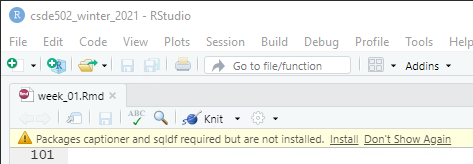

Change line 3 to include your name and e-mail address. 

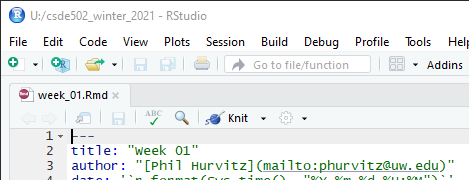

#### Render and view the enhanced output
Repeat the rendering process (`rmarkdown::render("Week_01.Rmd")`) 

The new HTML file has a number of enhancements, including a table of contents at the upper left, a table that is easier to read, a Leaflet map, captions and cross-references for the figures and table, an image derived from a PNG file referenced by a URL, the code used to generate various parts of the document that are produced by R code, and the complete source code for the document. A dowbnloadable version of the rendered file: [week_01.html](files/week_01.html).

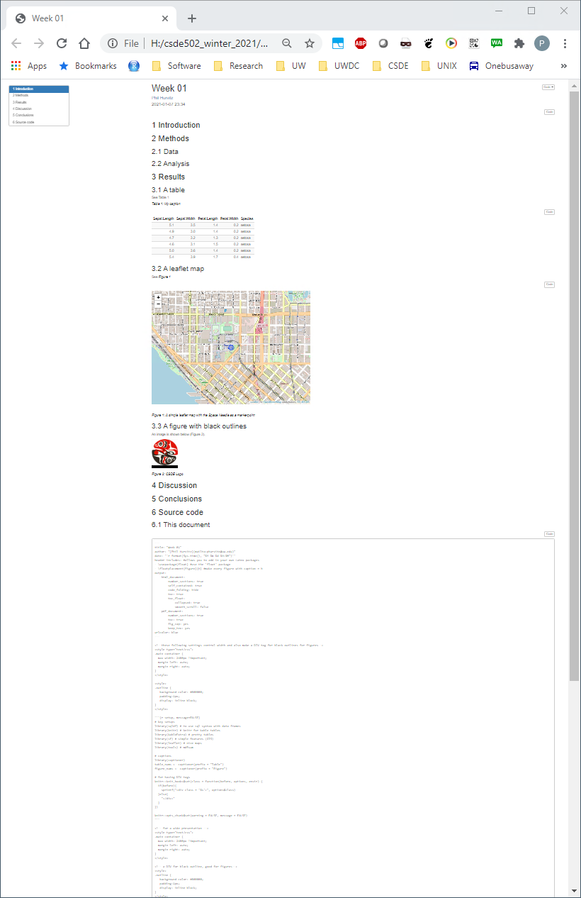

Including the source code for the document is especially useful for readers of your documents because it lets them see exactly what you did. An entire research chain can be documented in this way, from reading in raw data, performing data cleaning and analysis, and generating results.

## File systems
Although a full treatment of effective uses of file systems is beyond the scope of this course, a few basic rules are worth covering:

1. Never use spaces in folder or file names. 
    Ninety-nine and 44/100ths percent of the time, most modern software will have no problems handling file names with spaces. But that 0.56% of the time when software chokes, you may wonder why your processes are failing. If your directly and file names do not have spaces, then you can at least rule that out!
1. Use lowercase letters in directory and file names.
    In the olden days (DOS), there was not case sensitivity in file names. UNIX has has always used case sensitive file names. So 
    `MyGloriousPhDDissertation.tex` and `mygloriousphddissertation.tex` could actually be different files. Macs, being based on a UNIX kernel, also employ case sensitivity in file names. But Windows? No. Consider the following: there cannot be both `foo.txt` and `FOO.txt` in the same directory. 
    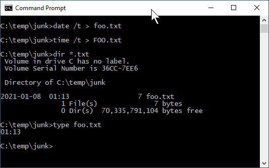
    
    So if Windows doesn't care, why should we? Save yourself some keyboarding time and confusion by using only lowercase characters in your file names.
1. Include dates in your file names.
    If you expect to have multiple files that are sequential versions of a file in progress, an alternative to using a content management system such as [git](https://git-scm.com/), particularly for binary files such as Word documents or SAS data files, is to have multiple versions of the files but including the date as part of the file name. If you expect to have multiple versions on the same date, include a lowercase alphabetical character; it is improbable that you would have more than 26 versions of a fine on a single calendar date. If you are paranoid, use a suffix number `0000`, `0002` .. `9999`. If you have ten thousand versions of the same file on a given date, you are probably doing something that is not right.
    Now that you are convinced that including dates in file names is a good idea, _please_ use the format `yyyy-mm-dd` or `yyyymmdd`. If you do so, your file names will sort in temporal order.
1. Make use of directories! 
   Although a folder containing 100,000 files can be handled programatically (if file naming conventions are used), it is not possible for a human being to visually scan 100,000 file names. If you have a lot of files for your project, consider creating directories, e.g., 
       - raw_data
       - processed_data
       - analysis_results
       - scripts
       - manuscript
1. Agonize over file names. 
    Optimally when you look at your file names, you will be able to know something about the content of the file. We spend a lot of time doing analysis and creating output. Spending an extra minute thinking about good file names is time well spent.


<h4>Source code for this document</h4>
[01-week01.Rmd](01-week01.Rmd)

```{r, comment='', echo=FALSE}
cat(readLines("01-week01.Rmd"), sep = '\n')
```
