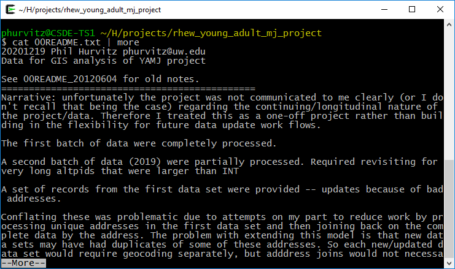
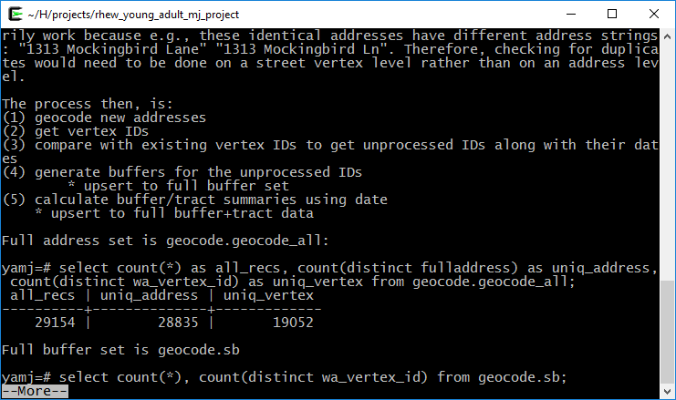

# Week 2 {#week2}

```{r, echo=FALSE, warning=FALSE, message=FALSE}
library(tidyverse)
library(magrittr)
library(knitr)
library(kableExtra)
library(readstata13)
```

<h2>Topics: R data structures; tidyverse</h2>
It is assumed that students in this course have a basic working knowledge of using R, including how to create variables with the assignment operator ("`<-`"), and how to run simple functions(e.g., `mean(dat$age)`). Often in courses that include using R for statistical analysis, some of the following foundations are not explained fully. This is not intended to be a comprehensive treatment of R data types and structures, but should provide some background for students who are either relatively new at using R or who have not had a systematic introduction.

The other main topic for today is ["tidyverse"](https://www.tidyverse.org/), which refers to a related set of R packages for data management, analysis, and display. See Hadley Wickham's [tidy tools manifesto](https://tidyverse.tidyverse.org/articles/manifesto.html) for the logic behind the suite of tools. For a brief description of the specific R packages, see [Tidyverse packages](https://www.tidyverse.org/packages/). This is not intended to be a comprehensive introduction, but should provide sufficient background for data handling to support most of the technical aspects of the rest of the course.

## Code to run for the in-class exercise

```{r, echo=FALSE}
# generate the R code to run in class
# O <- knitr::purl(input = "02-week02.Rmd", output = "r_code/week02.R", quiet = TRUE, documentation = 1)
```

For the exercise in class, download [week02.R](r_code/week02.R), which we will use to run the code listed in this R Markdown result.


## R data types
There are six fundamental data types in R:

1. logical
1. numeric
1. integer
1. complex
1. character
1. raw

The most atomic object in R will exist having one of those data types, described below. An atomic object of the data type can have a value, `NA` which represents an observation with no data (e.g., a missing measurement), or `NULL` which isn't really a value at all, but can still have the data type class.

You will encounter other data types, such as `Date` or `POSIXct` if you are working with dates or time stamps. These other data types are extensions of the fundamental data types.

To determine what data type an object is, use `is(obj)`, `str(obj)`, or `class(obj)`. 

```{r}
print(is("a"))

print(str(TRUE))

print(class(123.45))

print(class(as.integer(1000)))

n <- as.numeric(999999999999999999999)

print(class(n))
```

### Logical
Use `logical` values for characteristics that are either `TRUE` or `FALSE`. Note that if `logical` elements can also have an `NA` value if the observation is missing. In the following examples, 

```{r}
# evaluate as logical, test whether 1 is greater than two
a <- 1 > 2
```

```{r}
# create two numerical values, one being NA, representing ages
age_john <- 39
age_jane <- NA

# logical NA from Jane's undefined age
(jo <- age_john > 50)
(ja <- age_jane > 50)
```

Logical values are often expressed in binary format as 0 = `FALSE` and ` = `TRUE`. in R these values are interconvertible. Other software (e.g., Excel, MS Access) may convert logical values to numbers that you do not expect.

```{r}
(t <- as.logical(1))
(f <- as.logical(0))
```

### Numeric
`Numeric` values are numbers with range about 2e-308 to 2e+308, depending on the computer you are using. You can see the possible range by entering `.Machine` at the R console. These can also include decimals. For more information, see [Double-precision floating-point format](https://en.wikipedia.org/wiki/Double-precision_floating-point_format)


### Integer
`Integer` values are numerical, but can only take on whole, rather than fractional values, and have a truncated range compared to `numeric`. For example, see below, if we try to create an integer that is out of range. The object we created is an integer, but because it is out of range, is value is set to `NA`.

```{r}
i <- as.integer(999999999999999999999)

print(class(i))
```

### Complex
The `complex` type is used in mathematics and you are unlikely to use it in applied social science research unless you get into some heavy statistics. See [Complex number](https://en.wikipedia.org/wiki/Complex_number) for a full treatment.

### Character
`Character` data include the full set of keys on your keyboard that print out a character, typically [A-Z], [a-z], [0-9], punctuation, etc. The full set of ASCII characters is supported, e.g. the `accent aigu` in Café:

```{r}
print(class("Café"))
```

Also numbers can function as characters. Be careful in converting between numerical and character versions. For example, see these ZIP codes:

```{r error=TRUE}
# this is a character
my_zip <- "98115"

# it is not numeric.
my_zip + 2
```

```{r}
# we can convert it to numeric, although it would be silly to do with ZIP codes, which are nominal values
as.numeric(my_zip) + 2

# Boston has ZIP codes starting with zeros
boston_zip <- "02134"
as.numeric(boston_zip)
```

### Raw
`Raw` values are used to store raw bytes in hexadecimal format. You are unlikely to use it in applied social science research. For example, the hexadecimal value for the character `z` is `7a`:

```{r}
print(charToRaw("z"))

class(charToRaw("z"))
```


## R data structures


There are 5 basic data structures in R, as shown in the graphic: 

1. vector
1. matrix
1. array
1. list
1. data frame

In addition, the `factor` data type is very important

### Vector
A vector is an ordered set of elements of one or more elements of the same data type and are created using the `c()` constructor function. For example, a single value is a vector:

```{r}
# create a vector of length 1
a <- 1
is(a)
```


If you try creating a vector with mixed data types, you may get unexpected results; mixing character elements with other type elements will result in character representations, e.g., 

```{r}
c(1, "a", TRUE, charToRaw("z"))
```

Results will depend on the data type you are mixing, for example because logical values can be expressed numerically, the `TRUE` and `FALSE` values are converted to `1` and `0`, respectively.

```{r}
(c(1:3, TRUE, FALSE))
```

But if a character is added, all elements are converted to characters.

```{r}
c(1:3, TRUE, FALSE, "awesome!")
```

Order is important, i.e., 

`1, 2, 3` is not the same as `1, 3, 2`

R will maintain the order of elements in vectors unless a process is initiated that changes the order of those elements:

```{r}
# a vector 
(v <- c(1, 3, 2))

(sort(v))
```

You can get some information about vectors, such as length and data type:

```{r}
# create a random normal 
set.seed(5)
normvec1000 <- rnorm(n = 1000)

length(normvec1000)
class(normvec1000)
class(normvec1000 > 1)
```

Elements of vectors are specified with their index number (1 .. n):

```{r}
v <- seq(from = 0, to = 10, by = 2)
v[4]
```

### Matrix
A matrix is like a vector, in that it an contain only one data type, but it is two-dimensional, having rows and columns. A simple example:

```{r}
# make a vector 1 to 100
(v <- 1:100)

# load to a matrix
(m1 <- matrix(v, ncol = 10, byrow = TRUE))

# different r, c ordering
(m2 <- matrix(v, ncol = 10, byrow = FALSE))
```

If you try to force a vector into a matrix whose row $\times$ col length does not match the length of the vector, the elements will be recycled, which may not be what you want. At least R will give you a warning.

```{r}
(m3 <- matrix(letters, ncol = 10, nrow = 10))
```

### Array
An array is similar to matrix, but it can have more than one dimension. These can be useful for analyzing time series data or other multidimensional data. We will not be using array data in this course, but a simple example of creating and viewing the contents of an array:

```{r}
# a vector 1 to 27
v <- 1:27

# create an array, 3 x 3 x 3
(a <- array(v, dim = c(3, 3, 3)))

# array index is r, c, m (row, column, matrix), e.g., row 1 column 2 matrix 3:
(a[1,2,3])
```

### List
R lists are ordered collections of objects that do not need to be of the same data type. Those objects can be single-value vectors, multiple-value vectors, matrices, data frames, other lists, etc. Because of this, lists are a very flexible data type. But because they can have as little or as much structure as you want, can become difficult to manage and analyze.

Here is an example of a list comprised of single value vectors of different data type. Compare this with the attempt to make a vector comprised of elements of different data type:

```{r}
(l <- list("a", 1, TRUE))
```

Let's modify that list a bit:

```{r}
(l <- list("a", 
           1:20, 
           as.logical(c(0,1,1,0))))
```

The top-level indexing for a list is denoted using two sets of square brackets. For example, the first element of our list can be accessed by `l[[1]]`. For example, the mean of element 2 is obtained by `mean(l[[2]])`: ``r mean(l[[2]])``.

To perform operations on all elements of a list, use `lapply()`:

```{r}
# show the data types
(lapply(X = l, FUN = class))

# mean, maybe?
(lapply(X = l, FUN = function(x) {mean(x)}))
```
### Factor
Factors are similar to vectors, in that they are one-dimensional ordered sets. However, factors also use informational labels. For example, you may have a variable with household income as a text value:

* "<$10,000"
* "$10,000-$549,999"
* "$50,000-$99,999"
* "$100,000-$200,000"
* ">$200,000"

As a vector:

```{r}
(income <- c("<$10,000"
, "$10,000-$49,999"
, "$50,000-$99,999"
, "$100,000-$200,000"
, ">$200,000"))
```

Because these are characters, they do not sort in proper numeric order:

```{r}
sort(income)
```

If these are treated as a factor, the levels can be set for proper ordering:

```{r}
# create a factor from income and set the levels
(income_factor <- factor(x = income, levels = income))

# sort again
(sort(income_factor))
```

As a factor, the data can also be used in statistical models and the magnitude of the variable will also be correctly ordered.

### Data frame
Other than vectors, data frames are probably the most used data type in R. You can think of data frames as matrices that allow columns with different data type. For example, you might have a data set that represents subject IDs as characters, sex or gender as text, height, weight, and age as numerical values, income as a factor, and smoking status as logical. Because a matrix requires only one data type, it would not be possible to store all of these as a matrix. An example:

```{r}
# income levels 
inc <- c("<$10,000"
, "$10,000-$49,999"
, "$50,000-$99,999"
, "$100,000-$200,000"
, ">$200,000")

BMI <- 	data.frame(
   sid = c("A1001", "A1002", "B1001"),
   gender = c("Male", "Male","Female"), 
   height_cm = c(152, 171.5, 165), 
   weight_kg = c(81, 93, 78),
   age_y = c(42, 38, 26),
   income = factor(c("$50,000-$99,999", "$100,000-$200,000", "<$10,000"), levels = inc)
)
print(BMI)
```

## tidyverse
This section will introduce some of the main workhorse functions in tidy data handling. 

Installing tidyverse is straightforward but it may take some time to download and install all of the packages. Use

```
install.packages("tidyverse")
```

For today's lesson we will be using one of the Add Health data sets, [AHwave1_v1.dta](data/AHwave1_v1.dta). 

```{r warning=FALSE}
# read the dta file
dat <- readstata13::read.dta13("http://staff.washington.edu/phurvitz/csde502_winter_2021/data/AHwave1_v1.dta")
```

The data set includes variable labels, which make handling the data easier. Here we print the column names and their labels. Wrapping this in a `DT::data_table` presents a nice interface for showing only a few variables at a time and that allows sorting and searching.

```{r}
x <- data.frame(colname = names(dat), label = attributes(dat)$var.labels)
DT::datatable(data = x, caption = "Column names and labels in AHwave1_v1.dta.")
```


### magrittr{#magrittr}


The R package [`magrittr`](https://cran.r-project.org/web/packages/magrittr/index.html) allows the use of "pipes". In UNIX, pipes were used to take the output of one program and to feed as input to another program. For example, the UNIX command `cat` prints the contents of a text file. This would print the contents of the file `00README.txt`:

```cat 00README.txt```

but with large files, the entire contents would scroll by too fast to read. Using a "pipe", denoted with the vertical bar character `|` allowed using the `more` command to print one screen at a time by tapping the `Enter` key for each screen full of text:

```cat 00README.txt | more```

As shown in these two screen captures:





The two main pipe operators we will use in `magrittr` are `%>%` and '%<>%'.

`%>%` is the pipe operator, which functions as a UNIX pipe, that is, to take something on the left hand side of the operator and feed it to the right hand side. 

`%<>%` is the assignment pipe operator, which takes something on the left hand side of the operator, feeds it to the right hand side, and replaces the object on the left-hand side.

For a simple example of the pipe, to list only the first 6 lines of a data frame in base R, we use `head()`, e.g.,

```{r}
head(iris)
```

using a tidy version of this:

```{r}
iris %>% head()
```

In the R base version, we first read `head`, so we know we will be printing the first 6 elements of something, but we don't know what that "something" is. We have to read ahead to know we are reading the first 6 records of `iris`. In the tidy version, we start by knowing we are doing something to the data set, after which we know we are printing the first 6 records.

In base R functions, the process is evaluated from the inside out. For example, to get the mean sepal length of the _setosa_ species in iris, we would do this:

```{r}
mean(iris[iris$Species == 'setosa', "Sepal.Length"])
```

From the inside out, we read that we are making a subset of `iris` where Species = "setosa", we are selecting the column "Sepal.Length", and taking the mean. However, it requires reading from the inside out. For a large set of nested functions, we would have ` y <- f(g(h((i(x)))))`, which would require first creating the innermost function (`i()`) and then working outward.

In a tidy approach this would be more like y <- x %>% i() %>% h() %>% g() %>% f()` because the first function applied to the data set `x` is `i()`. Revisiting the mean sepal length of _setosa_ irises, example, under a tidy approach we would do this:

```{r}
iris %>% filter(Species == 'setosa') %>% summarise(mean(Sepal.Length))
```

Which, read from left to right, translates to "using the iris data frame, make a subset of records where species is _setosa_, and summarize those records to get the mean value of sepal length." The tidy version is intended to be easier to write, read, and understand. The command uses the `filter()` function, which will be described below.

### Data subsetting (dplyr)
`dplyr` is the tidyverse R package used most frequently for data manipulation. Selection of records (i.e., subsetting) is done using logical tests to determine what is in the selected set. First we will look at logical tests and then we will cover subsetting rows and columns from data frames.

##### Logical tests
If elements meet a logical test, they will end up in the selected set. If data frame records have values in variables that meet logical criteria, the records will be selected. 

Some logical tests are shown below.

###### `==`: equals

```{r}
# numeric tests
(1 == 2)
```

```{r}
(1 == 3 - 2)
```

```{r}
# character test (actually a factor)
(dat$imonth %>% head() %>% str_c(collapse = ", "))
((dat$imonth == "(6) June") %>% head())
```

```{r}
# character test for multiple patterns
(dat$imonth %in% c("(6) June", "(7) July") %>% head())
```


###### `>`, `>=`, `<`, `<=`: numeric comparisons

```{r}
1 < 2
```

```{r}
1 > 2
```

```{r}
1 <= -10:10
```

```{r}
1 >= -10:10
```

###### `!=`: not equals

```{r}
1 != 2
```

```{r}
# those of the first 6 days that are not 14
(dat$iday %>% head())
((dat$iday != 14) %>% head())
```

###### `!`: invert, or "not"
Sometimes it is more convenient to negate a single condition rather than enumerating all possible matching conditions.

```{r}
dat$imonth %>% head(20)
((!dat$imonth %in% c("(6) June", "(7) July")) %>% head(20))
```

#### Subset rows (`filter()`)
The `filter()` function creates a subset of records based on a logical test. Logical tests can be combined as "and" statements using the `&` operator and "or" statements using the `|` operator. Here we will perform a few filters on a subset of the data.

```{r}
# first 20 records, fist 10 columns
dat_sub <- dat[1:20, 1:10]
kable(dat_sub, format = "html") %>% kable_styling(bootstrap_options = c("striped", "hover", "condensed", "responsive"), full_width = F, position = "left")
```

Records from one month:

```{r}
# from May
(dat_sub %>% filter(imonth == "(5) May"))
```

Records from one month from females:

```{r}
(dat_sub %>% filter(imonth == "(5) May" & bio_sex == "(2) Female"))
```

Records from one month and from females or where the day of month was before the 15th, which will probably include some males:

```{r}
(dat_sub %>% filter(imonth == "(5) May" & (bio_sex == "(2) Female") | iday < 15))

```

Although these examples are silly and trivial, they show how `filter()` is used to create a selected set of data

#### Subset columns (`select()`)
A subset of columns can be extracted from data frames using the `select()` function, most simply using  named list of columns to keep.

```{r}
# select 3 columns
(dat_sub_sel <- dat_sub %>%   
    select("aid", "imonth", "iday"))
```

```{r}
# select all but two named columns
(dat_sub_sel <- dat_sub %>%   
    select(-"imonth", -"iday"))
```

```{r}
# select columns by position and whose name matches a pattern, in this case the regular expression "^i" meaning "starts with lowercase i"
(dat_sub_sel <- dat_sub %>%   
    select(1, matches("^i")))
```

`select()` can also be used to rename columns:

```{r}
#select one column, rename two columns
(dat_sub_sel %>% 
   select(aid, Month = imonth, Day = iday))
```

Or column renaming can be done with `rename()`, which maintains all input data and only changes the named columns:

```{r}
(dat_sub_sel %>% 
   rename(Month = imonth, Day = iday))
```

#### Subset rows and columns: `filter()` and `select()`
We can combine `filter()` and `select()` with a pipe to create a new data frame with a subset of rows and columns:

```{r}
# records with day of mongh > 15 and the first 3 named columns
(x <- dat_sub %>% 
    filter(iday > 15) %>%
    select(aid, imonth, iday)
   )
```

#### Create or calculate columns: `mutate()`
`mutate()` will create new named columns or re-calculate existing columns. Here we will make a column that stratifies birth month, with the cut at June. 

Although the birth month column (`h1gi1m`) is a factor, it is unordered, so we need to make it ordered before using the factor label in a numeric comparison. Fortunately, the factor labels were handled in correct order:

```{r}
# is this ordered?
is.ordered(dat$h1gi1m)
```

```{r}
# what are the levels?
(levels(dat$h1gi1m))
```

Assign order, create a new column, and print nicely:

```{r}
# make birth month ordered
dat$h1gi1m <- factor(dat$h1gi1m, ordered = TRUE)

# now is it ordered?
is.ordered(dat$h1gi1m)
```

```{r}
# perform the mutate() using the string representation of the factor for comparison
dat %>% 
    filter(iday > 15) %>%
    select(aid, imonth, iday, birth_month = h1gi1m) %>% 
    mutate(birth_1st_half = (birth_month < "(7) July")) %>% 
    head(20) %>% 
    kable() %>% 
    kable_styling(bootstrap_options = c("striped", "hover", "condensed", "responsive"), full_width = F, position = "left")
```

A silly example but showing that `mutate()` can change values of existing columns:

```{r}
(X <- dat_sub %>% 
     mutate(iday = -1000 + iday))
```

... so do be careful!

Other functions can be used with mutate include (but are by no means limited to!) 

* `if_else()`: create a column by assigning values based on logical criteria
* `case_when()`: similar to `if_else()` but for multiple input values
* `recode()`: change particular values

When we recoded the birth month, the output was a `logical` data type. If we wanted to create a 
`character` or `factor`, we could use `if_else()`. Here we are creating a new data frame based on several operations on `dat`.

```{r}
dat_1 <- dat %>% 
    filter(iday > 15) %>%
    head(20) %>%
    select(aid, imonth, iday, birth_month = h1gi1m) %>% 
    mutate(birth_year_half = ifelse(test = birth_month < "(7) July", yes = "first", no = "last"))

# make that a factor
dat_1$birth_year_half <- factor(dat_1$birth_year_half, levels = c("first", "last"))
    
# print
kable(dat_1) %>% 
    kable_styling(bootstrap_options = c("striped", "hover", "condensed", "responsive"), full_width = F, position = "left")
```

If one of your variables contains multiple values and you want to create classes, use `case_when()`. Here is a verbose example stratifying months into quarters. Also we are using the `magrittr` assignment pipe to update the input based on the statement, i.e., `dat_1` will change based on the commands we use. __Be careful using the assignment pipe because it will change your data frame.__

`case_when()` will recode in order or the way the command is written, so for months and quarters, it is not necessary to specify both ends of the quarter. Also any cases that are not explicitly handled can be addressed with the `TRUE ~ ...` argument; in this case, any records that had birth months that were not before September get assigned to quarter 4.

```{r}
dat_1 %<>% 
    mutate(quarter = case_when(
        birth_month < "(3) March" ~ 1,
        birth_month < "(6) June" ~ 2,
        birth_month < "(9) September" ~ 3,
        TRUE ~ 4))

# print
kable(dat_1) %>% 
    kable_styling(bootstrap_options = c("striped", "hover", "condensed", "responsive"), full_width = F, position = "left")
```

`recode()` is used to change the `birth_year_half` column:

```{r}
(dat_1 %<>% 
     mutate(birth_year_half_split = recode(birth_year_half,
                   "first" = "early",
                   "last" = "late")))
```

#### Summarizing/aggregating data
We will spend more time later in the course on data summaries, but an introduction with `dplyr` is worthwhile introducing at this stage. The two main functions are `summarise()` and `group_by()`.

A simple summary will tabulate the count of respondents and the mean age. The filter `! str_detect(h1gi1y, "Refused")` drops records from respondents who refused to give their birth year.

```{r}
dat %>% 
    filter(! str_detect(h1gi1y, "Refused")) %>% 
    mutate(yeari = str_replace_all(iyear, ".* ", "") %>% as.integer(),
           yearb = str_replace_all(h1gi1y, ".* ", "") %>% as.integer()) %>% 
    summarise(n = n(),
              mean_age = mean(yeari - yearb))
```

Here we will summarize age by sex using the `group_by()` function, and also piping to `prop_table()` to get the percentage:

```{r}
dat %>% 
    filter(! str_detect(h1gi1y, "Refused")) %>% 
    mutate(yeari = str_replace_all(iyear, ".* ", "") %>% as.integer(),
           yearb = str_replace_all(h1gi1y, ".* ", "") %>% as.integer()) %>% 
    group_by(bio_sex) %>% 
    summarise(mean_age = mean(yeari - yearb),
              sd_age = sd(yeari - yearb),
              n = n(),
              .groups = "drop_last") %>% 
    mutate(pct = prop.table(n) * 100)
```


<h4>Source code for this document</h4>
[02-week02.Rmd](01-week02.Rmd)

```{r, comment='', echo=FALSE}
cat(readLines("02-week02.Rmd"), sep = '\n')
```
