# Week 3 {#week3}

```{r, echo=FALSE}
library(tidyverse)
library(magrittr)
library(kableExtra)
library(stargazer)
library(pander)
library(psych)
library(readstata13)
library(knitr)
library(pander)
library(stargazer)
library(animation)
library(captioner)

table_nums <- captioner(prefix = "Table")
figure_nums <- captioner(prefix = "Figure")
```

<style>
.border1 {   
    border-width: 1px;   
    border-color: black;   
    border-style: solid; } 
</style>

<h2>Topics: Graphics and Tables in R; Captions and cross-references; R Markdown to MS Word; Bibliography</h2>

Because of its extensibility, HTML can be considered a preferred output from R Markdown. However, document formats are often necessary, particularly for term papers, theses/dissertations, and manuscripts for submission to scholarly journals. In this week's lesson, we will focus on the creation of these two output types, including adding bibliographies (which also applies to HTML output), and some basic `ggplot` graphics. 

For both PDF and Word output, much of the structure of your Rmd files will be the same as for HTML output. The major difference is how tables are handled, which we will explore in some detail. Static graphics are handled similarly across all output formats, other than HTML output can support dynamic graphics, such as the Leaflet map we saw in the first lesson, and responsive graphics as in [Shiny](https://shiny.rstudio.com/).

## Graphics in R Markdown
Data-driven graphics in Rmd files are typically created as base R graphics or with the `ggplot2` package. This tutorial is not intended to provide anywhere near a comprehensive treatment of creating graphics from data, but will provide instruction on some options for creating and including data-driven graphics as well as inserting graphics from image files.

See [Tips and tricks for working with images and figures in R Markdown documents](http://zevross.com/blog/2017/06/19/tips-and-tricks-for-working-with-images-and-figures-in-r-markdown-documents/) for a good explanation.

### Base R graphics
To include base R graphics, simply place the code to generate the graphic in an R code block, e.g., using the Add Health data from last week ([AHWave1_v1.dta](data/AHWave1_v1.dta)):


````
```{r}`r ''`
# since loading the data takes awhile, only do this if necessary
if(!exists("dat")){
    dat <- read.dta13("data/AHwave1_v1.dta")
}
# birth year = h1gi1y
# drop "Refused" birth year
# for birth year and interview year, replace anything before white space, convert to numeric
# subtract interview year - birth year
ages <- dat %>% 
    filter(! str_detect(h1gi1y, "Refused")) %>% 
    select(iyear, h1gi1y) %>% 
    mutate(yi = str_replace(iyear, ".*\\s", "") %>% as.numeric(),
           yb = str_replace(h1gi1y, ".*\\s", "") %>% as.numeric(),
           age = yi - yb)
           
# create a histogram using base graphics
hist(ages$age, xlab = "age (years)", las = 1)
```
````

... which will render the graph:

```{r, echo=FALSE, warning=FALSE}
# since loading the data takes awhile, only do this if necessary
if(!exists("dat")){
    dat <- read.dta13("data/AHwave1_v1.dta")
}
# birth year = h1gi1y
# drop "Refused" birth year
# for birth year and interview year, replace anything before white space, convert to numeric
# subtract interview year - birth year
ages <- dat %>% 
    filter(! str_detect(h1gi1y, "Refused")) %>% 
    select(iyear, h1gi1y) %>% 
    mutate(yi = str_replace(iyear, ".*\\s", "") %>% as.numeric(),
           yb = str_replace(h1gi1y, ".*\\s", "") %>% as.numeric(),
           age = yi - yb)
hist(ages$age, xlab = "age (years)", las = 1)
```

### `ggplot2` graphics
The `ggplot2` package creates compelling graphics that use a common syntax. The main difference between base R graphics and `ggplot2` graphics is that simply issuing the `plot()` or related command (e.g., `hist()`, `barplot()`) adds the graphic to the output, whereas with `ggplot()` it is necessary to issue a command that prints the graphic.

Following the previous example:

```{r}
# how many unique bins? 
bins <- length(unique(ages$age))

# create the graphic
g <- ggplot(data = ages, mapping = aes(x = age)) +
    geom_histogram(bins = bins)

# print the graphic
print(g)
```


### Embedding graphics files
Journals frequently require graphics files to be submitted separately from the manuscript. In this case, the graphic can be created and saved as a file and then inserted in the Rmd using code, but also accessed as a a stand-alone file. Let's take the previous example, but add correlation coefficients and other embellishments, create a graphics file and add the graphics into the Rmd.

The base graphics file is created using the `pdf()` function, although `png()` also works if that is the desired output format. PDF is a vector format, so it generally renders better over different zoom levels.

```{r, message=FALSE}
pdf(file = "ah_age_hist.pdf", width = 5, height = 5)
hist(ages$age, xlab = "age (years)", las = 1)
x <- dev.off()
```

Here we create a PNG format file:

```{r, message=FALSE}
png(file = "ah_age_hist.png", width = 5, height = 5, units = "in", res = 300)
hist(ages$age, xlab = "age (years)", las = 1)
x <- dev.off()
```

`ggplot2` graphics can be saved using `ggsave()`, e.g., for both PDF and PNG outputs. The `dpi` argument is important for bitmap images.

```{r}
ggsave(filename = "ah_age_hist_ggplot.pdf", plot = g, device = "pdf", width = 5, height = 5)
ggsave(filename = "ah_age_hist_ggplot.png", plot = g, device = "png", width = 5, height = 5, units = "in", dpi = 300)
```

Graphics can be added using several methods.

#### `knitr`
The `knitr::include_graphics()` function can be used to insert image files, with the caution that inserted PDF files may produce unwanted results. The syntax is:

````
```{r}`r ''`
include_graphics("graphics_filename")
```
````

and the code chunk can include `out.width`, `out.height` and other options.
\  
Here we insert a PDF with no code chunk options, which presents the image with a scroll bar, rather than the full image:

```{r}
include_graphics("ah_age_hist.pdf")
```

Here we specify in the code chunk options `out.height = "360px", out.width='360px', fig.align='left'`, 

```{r, out.height = "360px", out.width='360px', fig.align='left'}
include_graphics("ah_age_hist.pdf")

```

\  

... and with code chunk options `out.height = "400px", out.width='100%', fig.align='left'`

```{r, out.height = "400px", out.width='100%', fig.align='left'}
include_graphics("ah_age_hist.pdf")
```

\  

It seems that embedding PDF files is not optimal.

Here we insert a PNG: with no code chunk options:

```{r}
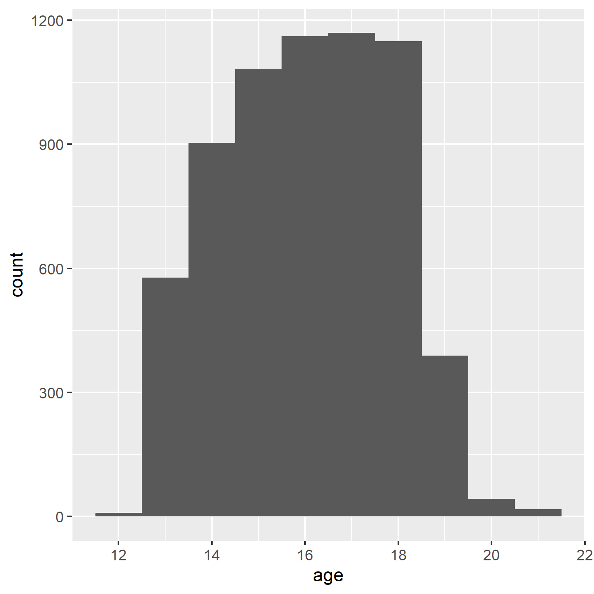
```

and with code chunk option `out.width = "50%"`

```{r, out.width = "50%"}

```

So embedding bitmapped images appears to work better than embedding PDF files. 

#### Markdown: ``

The native Markdown syntax:

```

```

includes a graphics file with an optional caption, e.g., here, a PDF with no caption, 

``


\  

The structure `` indicates this is an inserted graphic; a caption can be specified by including text within the square brackets, e.g., displays the caption below the inserted image (but with no caption number!). 

``````


... although it seems that inserting a PDF does odd things with image scrolling, while a PNG inserts the complete image without scroll bars.

``````:


#### HTML `` tag
If the file is to be rendered as HTML, _and_ the image is a bitmap, rather than vector PDF graphics, the `` tag can be used. Different utilities can be used to convert PDF to bitmapped formats, e.g., [ImageMagick](https://imagemagick.org/index.php) and [GraphicsMagick](http://www.graphicsmagick.org/).

``````


Including a percentage of page width:

``````


## Tables in R Markdown

We will look at three methods of including tables in R Markdown documents, using the packages `knitr` (with `kableExtra`), `pander`, and `stargazer`.

For the example table, we will use the frequency table of health $\times$ White and African American from Assignment 2:

```{r, warning=FALSE, message=FALSE, error=FALSE}
dat <- readstata13::read.dta13("http://staff.washington.edu/phurvitz/csde502_winter_2021/data/AHwave1_v1.dta")


# ordered factor; use fct_rev to establish the correct ordering where better health ranks higher
dat %<>% 
    mutate(h1gh1 = fct_rev(as.ordered(h1gh1)))

# stratify health; first we need to catch the "don't know" and "refused" as NAs
dat %<>%  
    mutate(health = 
    case_when(
        h1gh1 <= "(6) Refused" ~ as.character(NA),
        h1gh1 >  "(3) Good" ~ "high",
        h1gh1 <= "(3) Good" ~ "low"
    ))

# tabulate by White
tabhealth_white <- dat %>% 
    group_by(health, white = h1gi6a) %>% 
    summarise(n = n(), .groups = "drop_last") %>% 
    mutate("%" = round(n / sum(n) * 100, 2))

# tabulate by African Americal
tabhealth_afram <- dat %>% 
    group_by(health, afram = h1gi6b) %>% 
    summarise(n = n(), .groups = "drop_last") %>% 
    mutate("%" = round(n / sum(n) * 100, 2))

# column-bind and remove the second "health" column
sum_health_white_afram <- cbind(tabhealth_white, tabhealth_afram) %>% 
    select(-5)
```

### `kntir` (`kable()`) and `kableExtra`
The simple table using `kable()` is not too nice to read.

```{r}
kable(sum_health_white_afram)
```

So we add some `kabelExtra` options, :

```{r}
kable(sum_health_white_afram,
      col.names = c("health", "race", "n", "%", "race", "n", "%")) %>% 
        kable_styling(bootstrap_options = c("striped", "hover", "condensed", "responsive"), full_width = F, position = "left") 
```

However, because some column names are duplicated, it is necessary to add some column grouping:

```{r}
kable(sum_health_white_afram,
      col.names = c("health", "race", "n", "%", "race", "n", "%")) %>% 
    kable_styling(bootstrap_options = c("striped", "hover", "condensed", "responsive"), full_width = F, position = "left") %>% 
    add_header_above(c(" " = 1, "White" = 3, "African American" = 3))
```

We could also add some row groupings:

```{r}

sum_health_white_afram %>% 
    select(-1) %>% 
    kable(col.names = c("race", "n", "%", "race", "n", "%"), align=c(rep('r',times=6))) %>% 
    kable_styling(bootstrap_options = c("striped", "hover", "condensed", "responsive"), full_width = F, position = "left") %>% 
    add_header_above(c("White" = 3, "African American" = 3)) %>% 
    pack_rows("health high", 1, 4) %>% 
    pack_rows("health low", 5, 8) %>% 
    pack_rows("health N/A", 9, 12)
```

### `stargazer`
The [`stargazer`](https://cran.r-project.org/web/packages/stargazer/vignettes/stargazer.pdf) package is especially good for PDF outputs, but is fairly limited for HTML output.

```{r results='asis'}
stargazer(sum_health_white_afram, 
          type = "html", 
          summary = FALSE,
          rownames = FALSE)
```

### `pander`
`pander` can be used to create output HTML tables as well, although also with fewer options than `knitr` with `kableExtra`.

```{r}
pander(sum_health_white_afram)
```

## Captions to support tables, figures, and equations
There are several ways to support captions in R Markdown. The two main requirements for good captions: (1) automatic sequential numbering, and (2) ability to cross-reference.

Here are some options for adding captions:

### Figures

#### R Markdown code chunk `fig.cap`
Code chunks can include `fig_cap` as an option, as shown below. However, in standard Rmd $\rightarrow$ HTML there does not appear to be a method for cross-referencing. The code chunk would look like

<pre><code>```{r plotcars, fig.cap="Cars: speed and distance"}
plot(cars)
```</code></pre>


```{r plotcars, fig.cap="Cars: speed and distance", echo=FALSE}
plot(cars)
```

#### `bookdown` with `html_document2` output type

Using the `bookdown` package with `html_document2` output type, it is possible to cross-reference using the chunk name. For example, download and run this code [fig_cap_bookdown.Rmd](files/fig_cap_bookdown.Rmd)

Which renders a file:

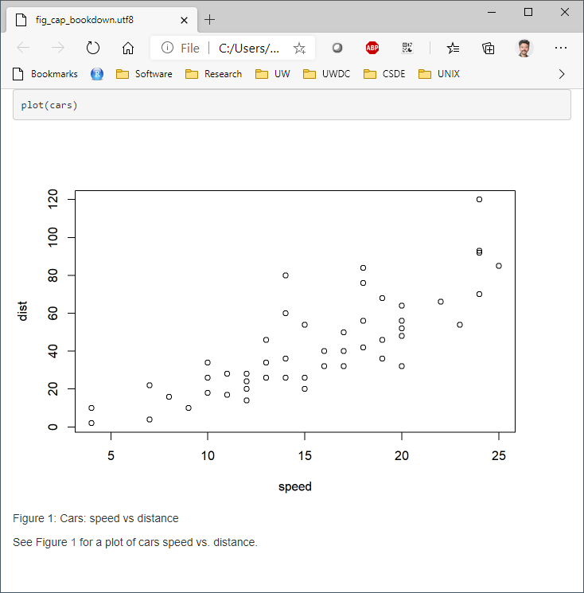

There seems to be no difference in the HTML output using

```
output: 
    bookdown::html_document2:
```

versus 

```
output: 
    html_document:
````

so the former is suggested as one way to include captions that support cross-referencing.

### Tables: `kable()` "caption"
Tables created with `kable()` can include the `caption` option. For example:

```{r}
kable(x = sum_health_white_afram, caption = "Self-reported health by race")
```

But there appears to be no direct way of cross-referencing within standard  Rmd $\rightarrow$ HTML.

#### `bookdown` with `html_document2` output type

Similarly for figures, the `bookdown` package with `html_document2` output type, it is possible to cross-reference using the chunk name. For example, download and run this code [table_cap_bookdown.Rmd](files/table_cap_bookdown.Rmd)

Which renders a file:

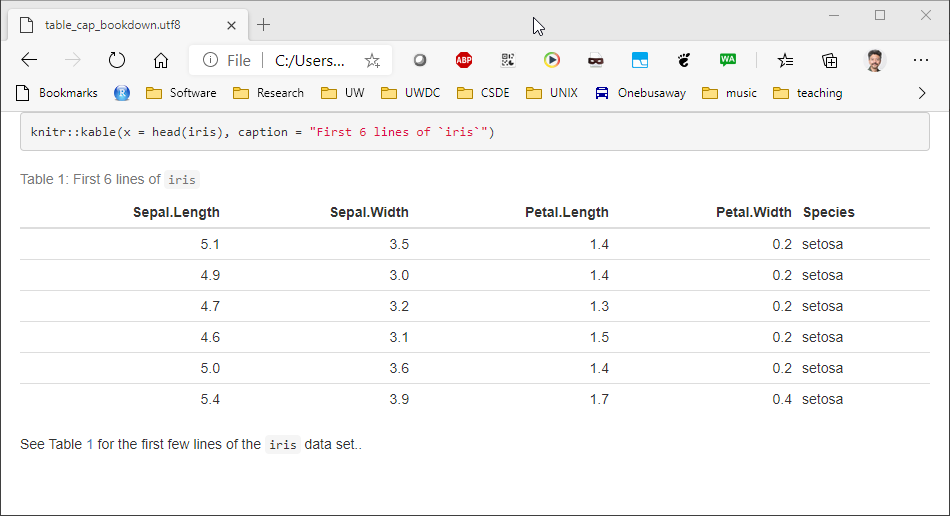

### Equations
Equations should be numbered in manuscripts. Using `bookdown` makes this quite easy. The equations themselves require $\LaTeX$ syntax. There are numerous web sites with examples and tutorials for creating mathematical expressions with $\LaTeX$ In this example, we include Einstein's famous equation:

<pre>
\begin{equation}
  E=mc^2
  (\#eq:emc)
\end{equation}
</pre>

and the sum of squares:

<pre>
\begin{equation}
  \sum_{i=1}^n i^2 = \frac{n(n+1)(2n+1)}{6}
  (\#eq:sumn)
\end{equation}
</pre>

The label for the equation is set with `(\#eq:emc)` and can be referenced using `\@ref(eq:emc)`. Operationalized, we see:

Einstein's equation, energy equals mass times the square of the speed of light is shown in \@ref(eq:emc).

\begin{equation}
  E=mc^2
  (\#eq:emc)
\end{equation}

To make a sum of squares of _n_ first integers, see \@ref(eq:sumn).

\begin{equation}
  \sum_{i=1}^n i^2 = \frac{n(n+1)(2n+1)}{6}
  (\#eq:sumn)
\end{equation}


### `captioner` for any captioning and cross-referencing figures and tables
The `captioner` package provides a flexible framework for captioning both tables and figures. 

The R code to do this:

```
library(captioner)
table_nums <- captioner(prefix = "Table")
figure_nums <- captioner(prefix = "Figure")
```

The `table_nums()` and `figure_nums()` functions are used to create captions and cross-references, and are not tied to any specific figure or table, as is the case with `kable` table captions and R code chunk `fig.cap`.

A caption is created, e.g., for a figure:

`` `r
figure_nums(name = "figname", caption = "My Caption")` ``

and referenced, e.g., 

`` `r
figure_nums(name = "figname", display = "cite")` ``

It does not matter whether the reference precedes or comes after the caption itself.

Another benefit to using `captioner` is that the output can be formatted using markdown syntax. For example, to format the caption in italics, use underscores:

`` _`r
figure_nums(name = "figname", caption = "My Caption")`_ ``

Although this method requires a bit more coding, it allows great flexibility. A comlete example:

As shown in `r figure_nums(name = "ageplot", display = "cite")`, the distribution of age has a slight negative skew.

```{r, fig.width=3, fig.height=3}
# how many unique bins? 
bins <- length(unique(ages$age))

# create the graphic
g <- ggplot(data = ages, mapping = aes(x = age)) +
    geom_histogram(bins = bins)

# print the graphic
print(g)
```

_`r figure_nums(name = "ageplot", caption = "Add Health age histogram")`_

Similarly, we can present the same data as a frequency table, as shown in `r table_nums(name = "agetab", display = "cite")`.

_`r table_nums(name = "agetab", caption = "Add Health age frequency table")`_

```{r}
ages %>% 
    group_by(age) %>% 
    summarise(n = n()) %>% 
    mutate(cumsum = cumsum(n),
        "%" = round(n / sum(n) * 100, 1),
        "cum %" = round(cumsum(n / sum(n) * 100), 1)) %>% 
    kable() %>% 
    kable_styling(bootstrap_options = 
        c("striped", "hover", "condensed", "responsive"), 
        full_width = F, 
        position = "left") 
```


## R Markdown to Microsoft Word
Microsoft Word ("Word"), is used widely to document research. Because of its advanced word processing and "track changes" capabilities, it is commonly used for preparation of manuscripts. Using R to generate output for Word is often a tedious process (e.g., create CSV files $\rightarrow$ paste the contents $\rightarrow$ convert to table; export R graphics with `png()` or `ggsave()` $\rightarrow$ insert the file).  

RMarkdown can be used to generate Word documents. This should be thought of as a one-way operation. That is to say, when a team works on a manuscript using Word, the typical work flow is that the lead author creates the first draft. Other authors make changes to the document using tracked changes. When the manuscript circulates over all authors, the lead author decides which changes to accept and which to reject, resulting in a new version. The process continues until the group of authors agrees that the manuscript is ready for publication.

Unfortunately there is no backwards path to take an existing Word docx and regenerate an Rmd (e.g., after you and your colleagues made a lot of changes to the Word docx). Nevertheless using this method could save you some "busy work" time in Word, as well as to provide a common stylistic template for your R outputs if you will be generating Word documents.

To export to a Word document, the following work flow should be followed:

1. Create a bare-bones Rmd file that contains all of the elements you want in your output, but little actual content.
1. Render the Rmd file to a Word docx file.
1. Open the docx file in Word and make any stylistic changes __using Word styles__ (see the workshop  [Microsoft Word for the Social Sciences](https://csde.washington.edu/workshop/microsoft-word-for-the-social-sciences/))
1. Use the style-edited docx file as a template in the Rmd file.
1. Write your complete Rmd file with the content you want to have placed in the Word docx file and then render. The output docx file will have the same stylistic configuration as the template docx.

A more detailed work flow:

To use Word output, first make a minimal RMarkdown document with Word output. 

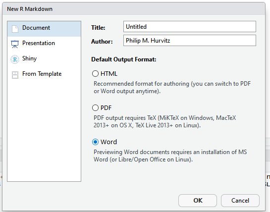 

Save the Rmd file and knit to to Word.

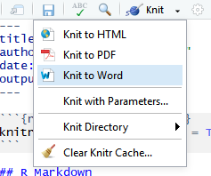 

The output document will have the elements from the Rmd file.

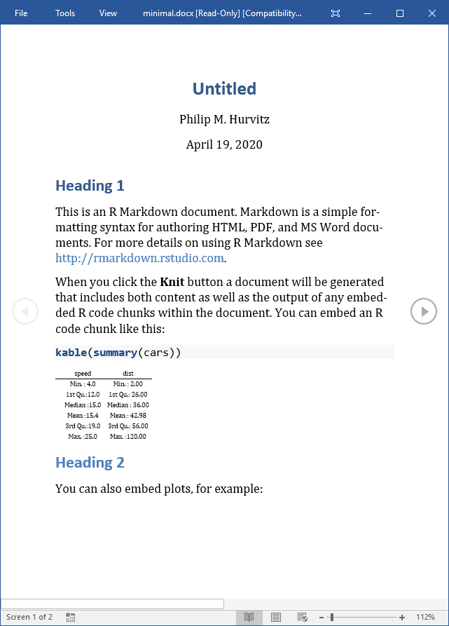 

The important part of this is that the Word document will have a number of styles. Make any changes to the styles or margins. This will become the template for the output containing the actual scientific content. ___Do not add, remove, or rename any styles in this document!___ Save a copy of the document with any stylistic changes. 

For example, here are some changes to the header styles:

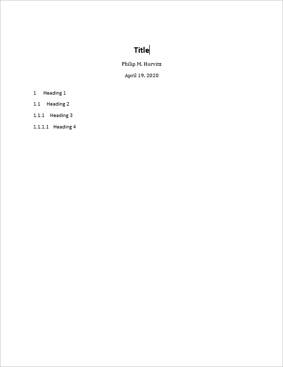 

Presumably, all of the styles in the output docx can be modified:

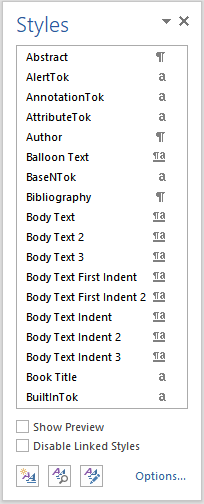

After you have made any changes, save the file as a "template":

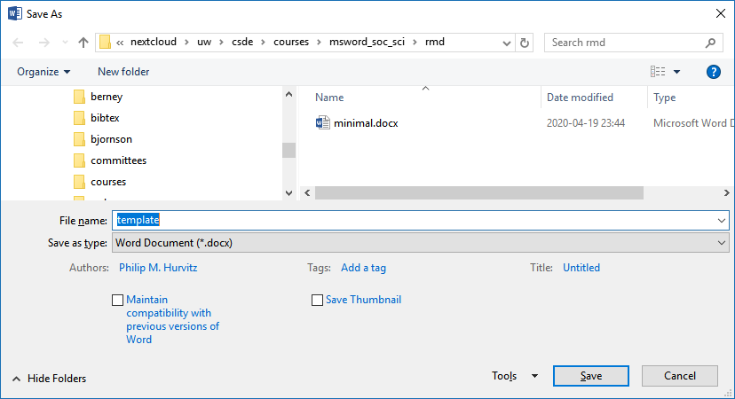

In the YAML header of the Rmd file with your scientific content, this construction, in which you specify the path name to the template document.

```
output:
  word_document:  
    reference_docx: "template.docx"
```

When the Rmd file is rendered to a Word document, the stylistic changes will be applied to the output. For example, just changing the head matter of the previous document and re-rendering shows that the heading styles were applied as defined.

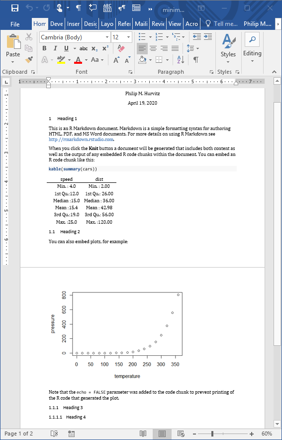

Although this overall functionality is somewhat limited, if you do have some Rmd code that generates some scientific content, and you want to output to a Word document with predefined formats, this will save you some busy work of reformatting.

## R Markdown output 
There are two different basic output formats available, document and presentation. As of this writing, the list of specific output types includes:

* `beamer_presentation`
* `context_document`
* `github_document`
* `html_document`
* `ioslides_presentation`
* `latex_document`
* `md_document`
* `odt_document`
* `pdf_document`
* `powerpoint_presentation`
* `rtf_document`
* `slidy_presentation`
* `word_document`

Various packages can also specify their own output types, e.g., `bookdown::html_document2` or `tufte::tufte_html.


### R Markdown rendering to specific formats
Remdering R Markdown files is done at the R console using the `rmarkdown::render()` function, e.g., 

```
rmarkdown::render(input = "input_filename.Rmd")
```

or by clicking the `Knit` control in RSTudio.

If the YAML header specifies multiple output formats, the first listed format will be used for the output if  other options are not specified in the `render()` function call. For example, for this header, the default output format is `bookdown::html_document2`

```
---
title: "A Document"
author: "Jane Doe"
date: "2021-01-23"
output: 
    bookdown::html_document2: default
    pdf_document: default
    html_document: default
    word_document: default
---
```

The RStudio interface will present the listed choices in the `Knit` pick list in the GUI, so the desired output format can be selected interactively:


Other supported outputs can be created, including those that are not listed in the YAML header by specifying the output format in the `render()` function, e.g. to create a [Slidy](https://www.w3.org/Talks/Tools/Slidy2/#(1)) presentation: 

```
rmarkdown::render(input = "input_filename.Rmd", output_format = "slidy_presentation")
```

To render a PDF file, use e.g., 

```
rmarkdown::render(input = "input_filename.Rmd", output_format = "pdf_document")
```

Using code rather than the RStudio GUI allows more flexible automation; you could have an R script that runs the `render()` function as part of a multi-step workflow. For example, if you had a continuous data collection process, the work flow could be coded and run with [cron](https://www.rdocumentation.org/packages/cronR) to generate a new PDF (or other file type) file on a daily basis.

### Testing `output_type()`
Because different output formats support (or do not support) different features, a test can be made for the output format to determine which code to run, using `is_html_output()` and `is_latex_output()`. Any R code within the Rmd file can be run or not run based on these tests. For a working example, download and render the file [output_type_test](files/output_type_test.Rmd). Using a single source, the [output rendered as HTML](files/output_type_test.html) appears as

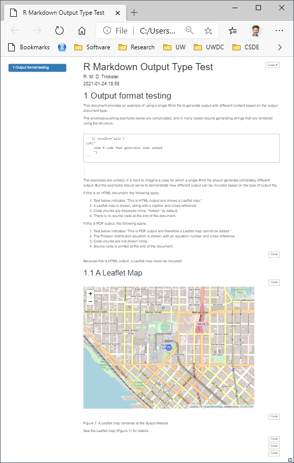

whereas the [PDF output](files/output_type_test.pdf) is rendered as

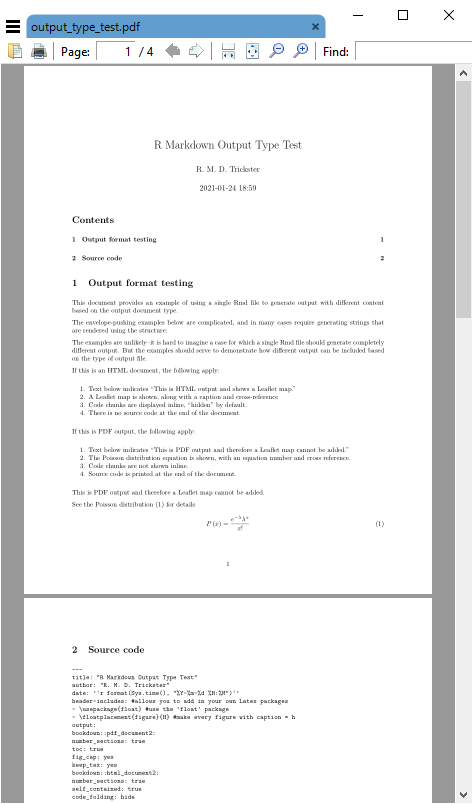

There appears to be no similar test for MS Word output, so for creating Word documents from Rmd files, it is suggested to create the Rmd from scratch with the intention of creating only Word output.

## Advantages and disadvantages of PDF
Portable document format (PDF) has a number of advantages:

1. Document formatting is maintained. Font face and positioning of elements is consistent. When some other formats are shared (e.g., MS Word), formatting is inconsistent. 
1. The format is widely used and able to be created from a variety of different proprietary and open software applications.
1. Files are often parsimonious in size. When large images are embedded, the file sizes can grow, but there are often options for downscaling images for smaller file size.
1. Files can be protected with passwords.
1. Files are supported across all operating systems (Windows, Mac, Linux, UNIX).
1. Multiple different elements can be included (text, images, tables).
1. The format has stood the test of time, having been introduced 1993. The standard was opened in 2008, allowing developers to create PDF outputs. This has led to PDF being the standard for fixed-format documents. 

The disadvantages:
1. Direct editing of PDF files is not straightforward (usually requires dedicated software), and often results in undesired layout changes. Therefore this is not a good format for collaborative editing.
1. Copy-and-paste from PDF often results in missing or extra spaces or strange characters.
1. R functions that produce HTML output cannot be used in PDF outputs.

## Bibliography in R Markdown
The `pandoc` engine that performs document conversion can generate bibliographies. See [Bibliographies and Citations](https://rmarkdown.rstudio.com/authoring_bibliographies_and_citations.html) for detailed information.

For this exercise, we will be using ${B\kern-0.1emi\kern-0.017emb}\kern-0.15em\TeX$ formatted references.

The YAML header needs to be formatted to include the bibliography file, which should either have a complete path name or be located in the same directory as the Rmd file. Similarly, any CSL (Citation Style Language) file should be specified. CSL files can be obtained from the [Zotero Style Repository
](https://www.zotero.org/styles)

The YAML header would include something of the form:

```
---
title: "My glorious, shiny dissertation"
output: 
    bookdown::html_document2
bibliography: myreferences_20200121.bib
csl: biomed-central.csl
---
```

When citations are made to references, the corresponding record will be automatically added to the end of the document.

For examples of syntax for both APA-like and AMA-like references and bibliographies, see the files 

* APA: [HTML](files/bibliography.html); [Rmd](files/bibliography.Rmd)
* AMA: [HTML](files/bibliography_ama.html); [Rmd](files/bibliography_ama.Rmd)


<h4>Source code for this document</h4>
[03-week03.Rmd](03-week03.Rmd)

```{r, comment='', echo=FALSE}
cat(readLines("03-week03.Rmd"), sep = '\n')
```
