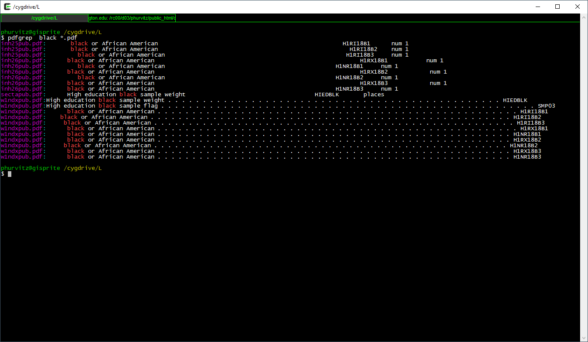
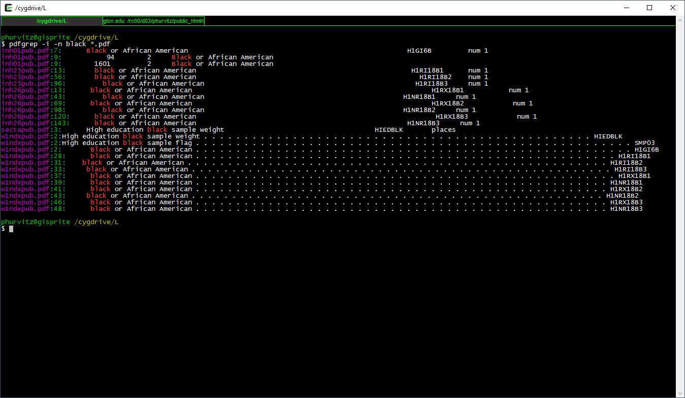
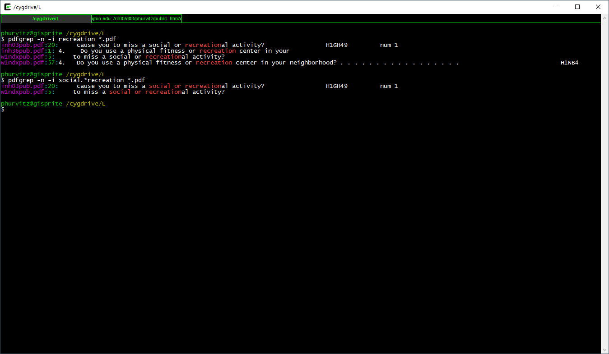
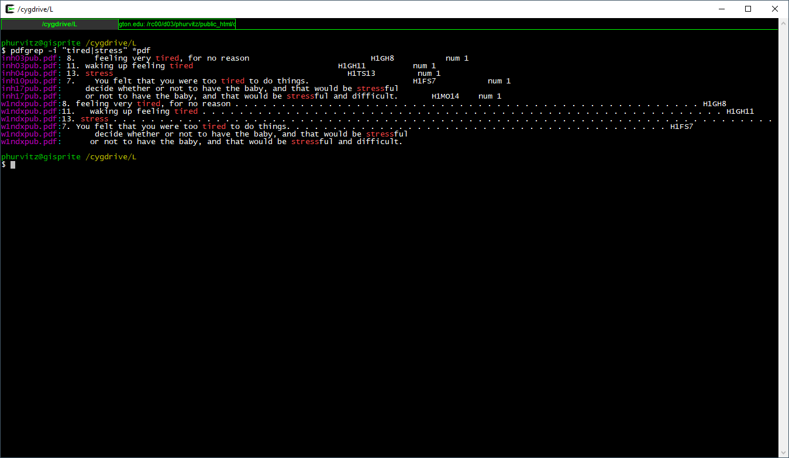

# Week 6 {#week6}

```{r, echo=FALSE, warning=FALSE, message=FALSE}
library(tidyverse)
library(magrittr)
library(knitr)
library(kableExtra)
library(readstata13)
library(haven)
library(pdftools)
```

<h2>Topic: Add Health data: exploring variables and data documentation</h2>

## The Add Health study data
The Add Health [web site](https://data.cpc.unc.edu/projects/2/view) describes the study:

> Initiated in 1994 and supported by five program project grants from the Eunice Kennedy Shriver National Institute of Child Health and Human Development (NICHD) with co-funding from 23 other federal agencies and foundations, Add Health is the largest, most comprehensive, nationally-representative longitudinal survey of adolescents ever undertaken. Beginning with an in-school questionnaire administered to a nationally representative sample of students in grades 7-12, the study followed up with a series of in-home interviews conducted in 1995, 1996, 2001-02, 2008, and 2016-18. Add Health participants are now full-fledged adults, aged 33-44, and will soon be moving into midlife. Over the years, Add Health has added a substantial amount of additional data for users, including contextual data on the communities and states in which participants reside, genomic data and a range of biological health markers of participants, and parental survey data.

The public-use data contain a subset of records and variables from the restricted-use full data set. The full data set requires a lengthy application process and meeting specific security standards. [CSDE](https://csde.washington.edu/) has a copy of most of the tables in the restricted-use data set on the [UW Data Collaborative](https://dcollab.uw.edu/data/add-health/).

We will be using the Wave 1 public-use Add Health data for most of the remainder of the term. This week we will briefly delve into the documentation and see how the data set use is supported by the documentation.

## Documentation
The Add Health data are very well documented. The PDFs contain the verbatim text of the survey questions, the range of encoded answers, and count tabulations of responses.

See the full set of metadata PDFs: [Wave1_InHome_Codebooks](data/metadata/Wave1_InHome_Codebooks/), and the [comprehensive codebook](data/metadata/Wave1_Comprehensive_Codebook/).

We will revisit the documentation later in this lesson.

## Data sets
The two data sets we will be using are [AHwave1_v1.dta.zip](data/AHwave1_v1.dta.zip) and [21600-0001-Data.dta.zip](data/21600-0001-Data.dta.zip). Download each file and unzip them, which will result in `AHwave1_v1.dta`, which we have encountered before, and `21600-0001-Data.dta`.

Both of these are Stata files. Stata files version 12 and below can be read with `foreign::read.dta()`, but version 13 and up require `haven::read_dta()` or `readstata13::read.dta13()`.

One of the benefits of the Stata file formats, as compared to e.g., CSV or Excel, is that the Stata files can contain metadata about the variables. The imported data frames themselves may have cryptic variable names, but more extensive _labels_. The R import process can expose those labels, making the data more easy to interpret

### `AHwave1_v1.dta`
`AHwave1_v1.dta` is a Stata version 13 file. Here we will look at the two import options.

#### `haven::read_dta()`
`haven::read_dta()` will read the data in as a data frame. Note for the code examples to run without modification, the assumption is that the data have been downloaded and unzipped in a subfolder named `data` within the current working directory. You can find out what the current working directory is by entering `getwd()` at the R prompt.

```{r}
# read the data
if(!file.exists("data/AHwave1_v1.dta")){
    unzip(zipfile = "data/AHwave1_v1.dta.zip", exdir = "data")
}
AHwave1_v1_haven <- haven::read_dta(file = "data/AHwave1_v1.dta")
```

Each labeled variable has attributes can be perused by listing structure:

```{r}
str(AHwave1_v1_haven$imonth)
```

or the first few values (`head()`):

```{r}
head(AHwave1_v1_haven$bio_sex)
```

or listing the attributes of the variable itself, which provides a more verbose listing of the variable label, data format, class, and value labels:

```{r}
attributes(AHwave1_v1_haven$h1gi1m)
```


In order to access the metadata as a single object, one can use the `lapply()` function, because the data frame can also be treated as a list. Here, each variable has its name, label, data format, and values extracted to a single data frame and presented as a `DT::datatable`. This provides the metadata in a format that is probably easier to use than the PDF documentation.

```{r}
AHwave1_v1_haven_metadata <- bind_cols(
    # variable name
    varname = colnames(AHwave1_v1_haven),
    # label
    varlabel = lapply(AHwave1_v1_haven, function(x) attributes(x)$label) %>% 
        unlist(),
    # format
    varformat = lapply(AHwave1_v1_haven, function(x) attributes(x)$format.stata) %>%
        unlist(),
    # values
    varvalues = lapply(AHwave1_v1_haven, function(x) attributes(x)$labels) %>% 
        # names the variable label vector
        lapply(., function(x) names(x)) %>% 
        # as character
        as.character() %>% 
        # remove the c() construction
        str_remove_all("^c\\(|\\)$")
)

DT::datatable(AHwave1_v1_haven_metadata)

```

#### `readstata13::read.dta13()`
`readstata13::read.dta13()` will similarly read the data as a data frame. There are a number of different options for converting factors, so if you are dealing with a lot of Stata files you may want to become familiar with some of these options.

For example, using all default options kicks out some warnings about double precision coding and missing factor labels. _[Note: to hide these warnings, for better or worse (i.e., you might not want to hide them), use the code chunk option `warning=FALSE`]._

```{r}
# read the data
AHwave1_v1_rs13 <- readstata13::read.dta13(file = "data/AHwave1_v1.dta")
```

```{r}
# read the data
AHwave1_v1_rs13 <- readstata13::read.dta13(file = "data/AHwave1_v1.dta", generate.factors = TRUE, nonint.factors = TRUE)
```

Metadata can be generated similarly:

```{r}
AHwave1_v1_rs13_metadata <- bind_cols(
    varname = colnames(AHwave1_v1_rs13),
    varlabel = attributes(AHwave1_v1_rs13)$var.labels,
    varformat = attributes(AHwave1_v1_rs13)$formats
)

# value ranges; need to do this separately because those variables with no value labels were not accounted for
varvalues <- bind_cols(
    varname = names(attributes(AHwave1_v1_rs13)$label.table) %>% tolower,
    vals = attributes(AHwave1_v1_rs13)$label.table %>% 
    lapply(., function(x) names(x)) %>% 
    as.character() %>% 
    str_remove_all("^c\\(|\\)$"))

# join
AHwave1_v1_rs13_metadata %<>% 
    left_join(varvalues, by = "varname")

DT::datatable(AHwave1_v1_rs13_metadata)
```

The default conversion creates factors, so the tables _may_ be easy to read/interpret ...

```{r}
head(x = AHwave1_v1_rs13$imonth, n = 6)
```

... but programming will require more work because the factors would either need to be explicitly named, e.g.,

```{r}
AHwave1_v1_rs13 %>% 
    head(10) %>% 
    filter(imonth == "(6) June") %>% 
    select(aid, imonth, iday)
```

Because the factors are really just labelled numbers, one could use the numeric values, but care needs to be taken:

```{r}
levels(AHwave1_v1_rs13$imonth) %>% t() %>% t()
```

Because not all months are represented in the data, the numerical value of the month may not be what you expect. For example, the 4th month factor level is "(6) June" rather than "(4) April".

Compare this with the results from `haven::read_dta()`. The values are not factors, but labelled double-precision numbers:

```{r}
head(AHwave1_v1_haven$imonth)
```

To perform a similar `filter()` & `select()` operation with the haven version:

```{r}
AHwave1_v1_haven %>% 
    head(10) %>% 
    filter(imonth == 6) %>% 
    select(aid, imonth, iday)
```

___Which approach do you prefer?___

### `21600-0001-Data.dta`
`21600-0001-Data.dta` is a much larger data set. It has the same count of records, but more columns than `AHwave1_v1.dta`.

```{r}
# read in the larger data set
if(!file.exists("data/21600-0001-Data.dta")){
    unzip(zipfile = "data/21600-0001-Data.dta.zip", exdir = "data")
}
data_21600_0001 <- haven::read_dta(file = "data/21600-0001-Data.dta")
if(file.exists("data/21600-0001-Data.dta")){
    file.remove(file = "data/21600-0001-Data.dta")
}

# dimensions of the two
dim(AHwave1_v1_haven)
dim(data_21600_0001)
```

In fact, `AHwave1_v1.dta` seems to be a subset of `21600-0001-Data.dta`. We can show this by lower casing the column names and then using a `select()` for the same named columns

```{r}
# lowercase the column names
colnames(data_21600_0001) %<>% str_to_lower()

# select() some columns of the same name
dat <- data_21600_0001 %>% 
    select(colnames(AHwave1_v1_haven))

# identical?
identical(dat, AHwave1_v1_haven)
if(file.exists("data/AHwave1_v1.dta")){
    file.remove("data/AHwave1_v1.dta")
}
```

We can build a similar table of metadata, but this time as a function:

```{r}
# a generic(?) function to generate metadata for a Stata file read by haven::read_dta()
# x is a haven data frame
f_haven_stata_metadata <- function(x){
    # variable names
    varname <- colnames(x)
    # labels
    varlabel <- x %>% 
        lapply(., function(x) attributes(x)$label) %>% 
        unlist()
    # format
    varformat <- x %>% 
        lapply(., function(x) attributes(x)$format.stata) %>%
        unlist()
    # values
    varvalues <- x %>% 
        lapply(., function(x) attributes(x)$labels) %>% 
        # names the variable label vector
        lapply(., function(x) names(x)) %>% 
        # as character
        as.character() %>% 
        # remove the c() construction
        str_remove_all("^c\\(|\\)$")  
    
    bind_cols(varname = varname, 
              varlabel = varlabel, 
              varformat = varformat,
              varvalues = varvalues)
}

# generate the metadata
data_21600_0001_metadata <- f_haven_stata_metadata(data_21600_0001)

# print the metadata table as a DT::datatable
DT::datatable(data_21600_0001_metadata)

```

## Searching through documentation
Good data sets have good documentation. Sometimes the documentation is voluminous, as is the case for the Add Health data. With voluminous metadata, are there good approaches to finding what you are interested in without opening each PDF file, reading the table of contents, searching for string matches, etc.?

This section will cover two tools to make searching through PDF files less onerous and more efficient. The two utilities are `pdfgrep` and `pdftools::pdf_text()`

### `pdfgrep`
`grep` is a string-matching utility developed mainly for UNIX, now available for all common operating systems. It is also implemented in base R with the function `grep()`. The name comes from the ed command g/re/p ($\underline{g}$lobally search for a $\underline{r}$egular $\underline{e}$xpression and $\underline{p}$rint matching lines), typically used to print the line number of a text file containing the search pattern. 

If you are not familiar with regular expressions and you plan on doing computational social sciences, the sooner you learn, the better. See the R help topic for `base::regex()`.

We won't be covering `grep` in general here, but will introduce some of the regular expression logic in `pdfgrep`. 

Start by installing a version of `pdfgrep`. These are three implementations, one for Mac and two for Windows. The demo today will use the Cygwin version. The native Windows version is not as powerful/customizable as the Cygwin version and will also likely be more comparable with the Mac version. ___Note:___ `pdfgrep` will only work on PDF files that contain text. PDFs that are composed solely from scanned images contain no text and are therefore not searchable using regular expressions.

[pdfgrep for native Windows](https://soft.rubypdf.com/software/pdfgrep-windows-version)

[pdfgrep for Cygwin under Windows](https://cygwin.com/cgi-bin2/package-cat.cgi?file=x86%2Fpdfgrep%2Fpdfgrep-1.4.1-1&grep=pdfgrep)

[pdfgrep for Mac](http://macappstore.org/pdfgrep/)

A zipped file containing all of the metadata files for the In Home Questionnaire is available as [Wave1_InHome_Codebooks.pdf.zip](data/metadata/Wave1_InHome_Codebooks/Wave1_InHome_Codebooks.pdf.zip). Download the file and unzip it in an appropriate location.

#### A few use examples
_[Note: the images below may be hard to read; clicking them will open them in full-size; click with the middle mouose button to open in a new tab.]_

Here we will search through the entire set of PDF files for the regular expression `black`. First, let's list the PDF files using

`
ls *.pdf
`

[](images/week06/2021-02-11_21_31_11-_cygdrive_L.png)


The syntax for the search is 

`
pdfgrep black *.pdf
`

[](images/week06/2021-02-11_21_45_41-_cygdrive_L.png)

This prints the file name and the matching text of each PDF containing the regular expression `black`. Suppose we wanted to search for `black` or `Black` or `BLACK`? Use the flag `-i` which is short for case $\underline{i}$nsensitive.

`
pdfgrep -i black *.pdf
`

[](images/week06/2021-02-11_21_47_06-_cygdrive_L.png)

This shows all files that contain `black` in any case combination. 

We might want to know where to look (i.e., page number) in the file. Using the `-n` flag prints the page $\underline{n}$umber.

[](images/week06/2021-02-11_21_47_38-_cygdrive_L.png)

Seeing that there are several matches in `inh25pub.pdf`, the first match on page 13, let's view that:

[](images/week06/2021-02-11_22_16_08-inh25pub.pdf.png)

Let's look for another pattern, the word `recreation`:

`
pdfgrep -n -i recreation *.pdf
`

[](images/week06/2021-02-11_21_48_14-_cygdrive_L.png)

Seeing the matches, we might want to narrow the search to include only "social or recreation"al activity. Here, the regular expression is `social.*recreation`, where the `.*` regexp translates to "any number of any characters."


[](images/week06/2021-02-11_21_48_34-_cygdrive_L.png)


We will perform one more pattern match. Suppose we were interested in being tired or stressed. The regexp pattern `"pat1|pat2"` (note the quotes and the vertical bar). The quotes indicate to the shell that [this is not a pipe](#magrittr), but part of the regexp.

Here the full expression to show those metadata files that match either of these patterns.

`
pdfgrep -i "tired|stress" *.pdf
`

[](images/week06/2021-02-11_21_54_04-_cygdrive_L.png)

___Why___, you may ask, if we created those fancy metadata tables from the data, would we want to search for specific strings in the PDF documentation? Because the full documentation is likely to provide more complete explanations, whereas the metadata created from the data labels is only a brief description.

### `pdftools::pdf_text()`
Staying completely within R, we can perform similar searches through PDF files. We start with `pdftools::pdf_text()`, which converts PDFs to text vectors, where each page is converted to one vector element. This can be piped through text-matching functions, such as `base::grep()` or `stringr::str_match()` (`stringr` is loaded by `tidyverse`).

Unlike `pdfgrep`, which can serially search through a set of files in a directory, `pdf_text()` requires additional work. Here is an example that mimics searching for the case-insensitive regular expression `black` in the set of PDFs.

We create a function that searches through a single PDF and then loop the function over the set of PDFs in a specified folder, returning the file name list, the pattern we searched on, the page number with the match, and whether the search was case sensitive or not.

```{r}
# a function to get matching strings in a PDF, ignore case
f_pdf_str_match <- function(x, pat, ignore.case = TRUE){
    # convert the PDF to text
    mytext <- pdf_text(x)
    # pattern
    if(ignore.case){
        mypat <- regex(pat, ignore_case = TRUE)
    } else {
        mypat <- pat
    }
    # match strings = pages
    pages <- str_which(string = mytext, pattern = mypat)
    if(length(pages) == 0){
        return(data.frame(fname = x, pat, page_num = as.integer(NA), ignore.case))
    }
    # create a data frame
    data.frame(fname = x, pat, page_num = pages, ignore.case)
}

# a list of my PDFs
mypdfs <- list.files(path = "data/metadata/Wave1_InHome_Codebooks", pattern = "*.pdf$", full.names = TRUE)

# an empty data frame
x <- NULL

# run each one
for(i in mypdfs){
    x <- rbind(x, f_pdf_str_match(i, "black", ignore.case = TRUE))
}

# ignore NAs
x %>% filter(!is.na(page_num))

```

## Conclusion
We will use these data sets and metadata for the next several lessons. The methods presented in today's lesson should increase efficiency and reduce busy-work.

## Source code
[06-week06.Rmd](06-week06.Rmd)

```{r comment=''}
cat(readLines(con = "06-week06.Rmd"), sep = '\n')
```
