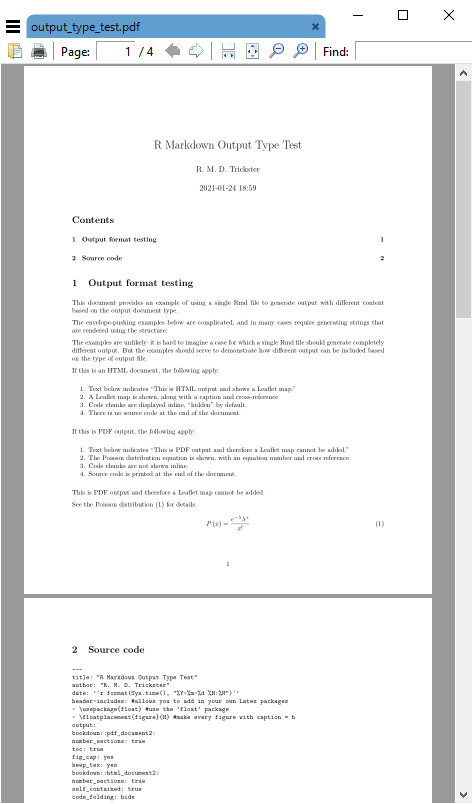

<style>
.border1 {   
    border-width: 1px;   
    border-color: black;   
    border-style: solid; } 
</style>


```{r setup, include=FALSE}
library(sf)
library(leaflet)
library(kableExtra)
library(magrittr)
library(knitr)

# handle echo
if(is_html_output()){
    knitr::opts_chunk$set(echo = TRUE)
} else {
    knitr::opts_chunk$set(echo = FALSE)
}
```

## R Markdown output 
There are two different basic output formats available, document and presentation. As of this writing, the list of specific output types includes:

* `beamer_presentation`
* `context_document`
* `github_document`
* `html_document`
* `ioslides_presentation`
* `latex_document`
* `md_document`
* `odt_document`
* `pdf_document`
* `powerpoint_presentation`
* `rtf_document`
* `slidy_presentation`
* `word_document`

Various packages can also specify their own output types, e.g., `bookdown::html_document2` or `tufte::tufte_html.


### R Markdown rendering to specific formats
Remdering R Markdown files is done at the R console using the `rmarkdown::render()` function, e.g., 

```
rmarkdown::render(input = "input_filename.Rmd")
```

or by clicking the `Knit` control in RSTudio.

If the YAML header specifies multiple output formats, the first listed format will be used for the output if  other options are not specified in the `render()` function call. For example, for this header, the default output format is `bookdown::html_document2`

```
---
title: "A Document"
author: "Jane Doe"
date: "2021-01-23"
output: 
    bookdown::html_document2: default
    pdf_document: default
    html_document: default
    word_document: default
---
```

The RStudio interface will present the listed choices in the `Knit` pick list in the GUI, so the desired output format can be selected interactively:


Other supported outputs can be created, including those that are not listed in the YAML header by specifying the output format in the `render()` function, e.g. to create a [Slidy](https://www.w3.org/Talks/Tools/Slidy2/#(1)) presentation: 

```
rmarkdown::render(input = "input_filename.Rmd", output_format = "slidy_presentation")
```

To render a PDF file, use e.g., 

```
rmarkdown::render(input = "input_filename.Rmd", output_format = "pdf_document")
```

Using code rather than the RStudio GUI allows more flexible automation; you could have an R script that runs the `render()` function as part of a multi-step workflow. For example, if you had a continuous data collection process, the work flow could be coded and run with [cron](https://www.rdocumentation.org/packages/cronR) to generate a new PDF (or other file type) file on a daily basis.

### Testing `output_type()`
Because different output formats support (or do not support) different features, a test can be made for the output format to determine which code to run, using `is_html_output()` and `is_latex_output()`. Any R code within the Rmd file can be run or not run based on these tests. For a working example, download and render the file [output_type_test](../files/output_type_test.Rmd). Using a single source, the [output rendered as HTML]((files/output_type_test.html) appears as


whereas the [PDF output](files/output_type_test.pdf) is rendered as



There appears to be no similar test for MS Word output, so for creating Word documents from Rmd files, it is suggested to create the Rmd from scratch with the intention of creating only Word output.

## Advantages and disadvantages of PDF
Portable document format (PDF) has a number of advantages:

1. Document formatting is maintained. Font face and positioning of elements is consistent. When some other formats are shared (e.g., MS Word), formatting is inconsistent. 
1. The format is widely used and able to be created from a variety of different proprietary and open software applications.
1. Files are often parsimonious in size. When large images are embedded, the file sizes can grow, but there are often options for downscaling images for smaller file size.
1. Files can be protected with passwords.
1. Files are supported across all operating systems (Windows, Mac, Linux, UNIX).
1. Multiple different elements can be included (text, images, tables).
1. The format has stood the test of time, having been introduced 1993. The standard was opened in 2008, allowing developers to create PDF outputs. This has led to PDF being the standard for fixed-format documents. 

The disadvantages:
1. Direct editing of PDF files is not straightforward (usually requires dedicated software), and often results in undesired layout changes. Therefore this is not a good format for collaborative editing.
1. Copy-and-paste from PDF often results in missing or extra spaces or strange characters.
1. R functions that produce HTML output cannot be used in PDF outputs.
